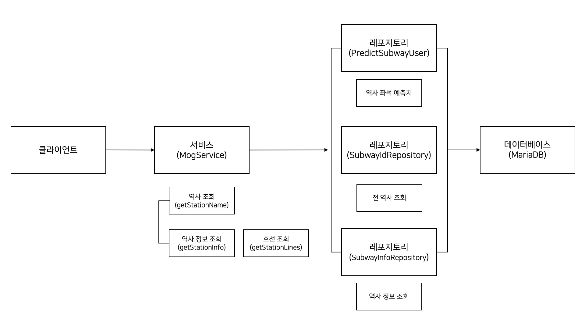

# Java_Metro_Of_Galaxy

## 개발환경
* Ubuntu 20.04.2 LTS
* Intellij Community

## 기능
* OpenAPI를 활용하여 특정 역, 특정 시간의 지난 이용객 수 반환
* 데이터베이스 내에 저장되어있는 모든 역사 명 반환
* 특정 역에 대한 정보(주소, 전화번호 등)를 반환

## 구조

### MogService
* 조회
  * 데이터베이스 내 모든 역사에 대한 이름 조회
  * 특저 역사에 대한 정보 조회 (전화번호, 주소, 이용객 수, 앉을 수 있는 예측치 등)

### PredictSubwayUser
* 특정 역사, 특정 시간대의 지하철의 앉을 수 있는 예측치가 저장되어 있는 DB에 접근

### SubwayIdRepository
* 기본적인 역사 정보(호선, 역사명)이 저장되어 있는 DB에 접근

### SubwayInfoRepository
* 역사 별 상세 정보(주소, 전화번호 등)이 저장되어 있는 DB에 접근

## Tech Stack
* Java 11
* Spring Boot (Spring Data JPA)
* Swagger 2
* MariaDB
* OpenAPI ([서울 열린데이터 광장, 서울시 지하철 호선별 역별 시간대별 승하차 인원 정보](http://data.seoul.go.kr/dataList/OA-12252/S/1/datasetView.do))
